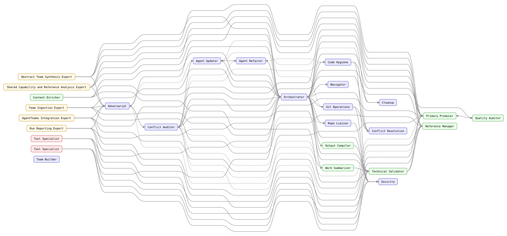
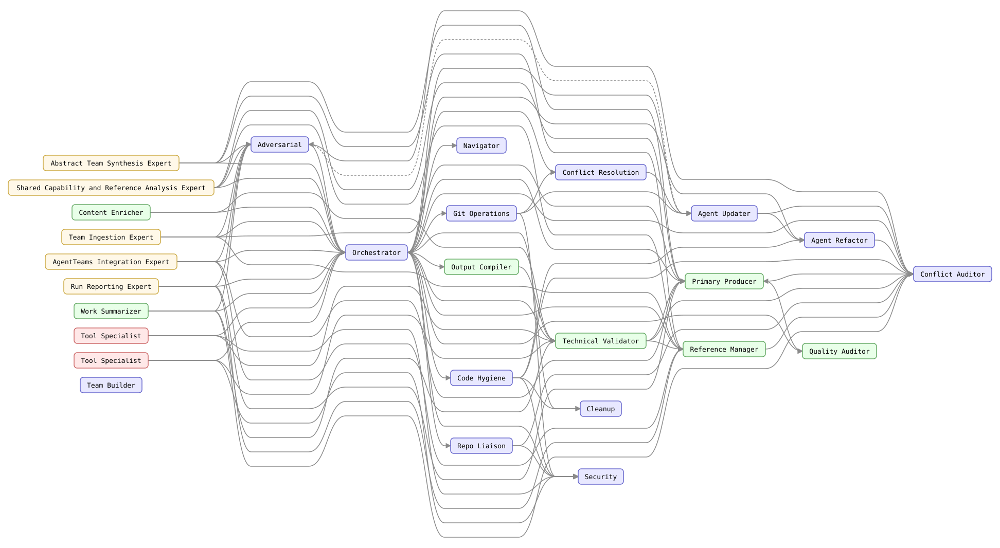
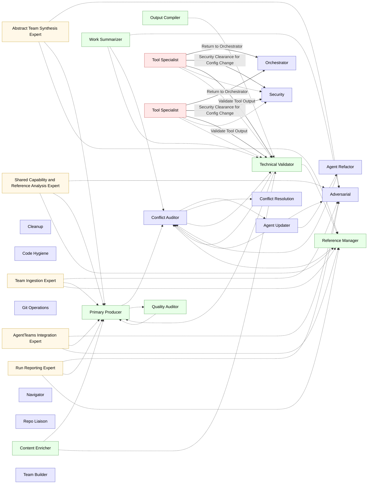
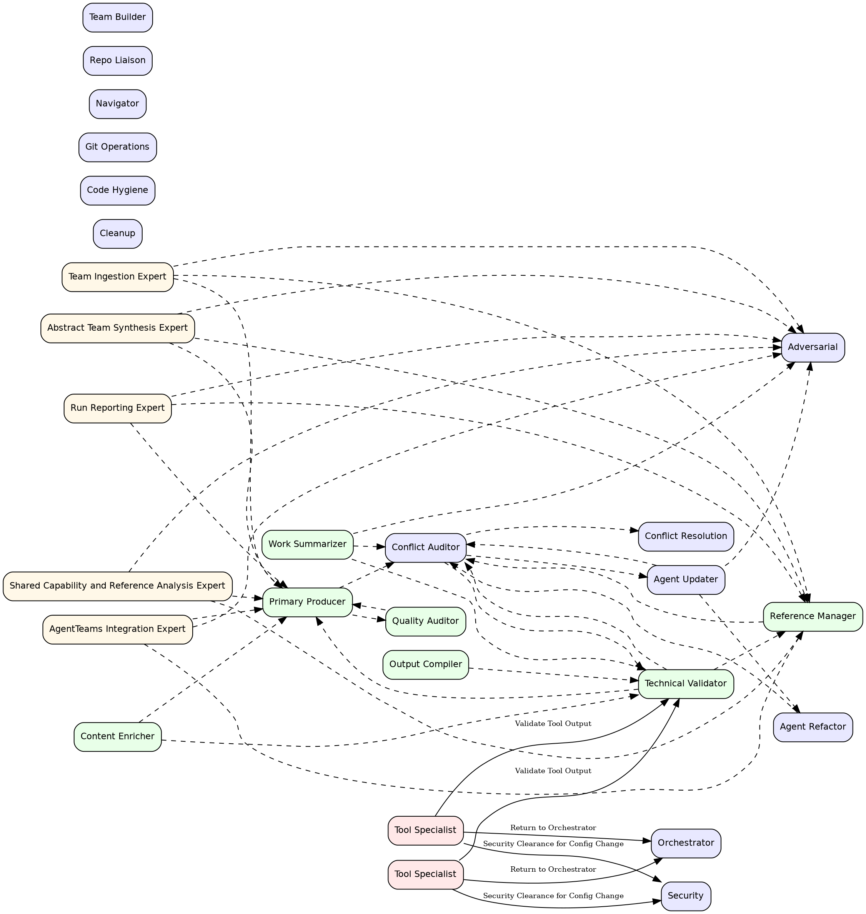

<!-- AGENTTEAMS:BEGIN content v=1 -->
# daily-pipeline — Agent Team Topology

> **Auto-generated.** Regenerated on every `build_team.py` run.
> Do not edit manually — changes will be overwritten.

---

## Team Topology Graph



The handoff-only control-flow backbone (agents-list edges omitted):



---

## Node Legend

| Colour | Agent Type |
| --- | --- |
| <svg width="12" height="12"><rect width="12" height="12" fill="#e8e8ff" stroke="#6666cc"/></svg> Blue-lavender | Governance |
| <svg width="12" height="12"><rect width="12" height="12" fill="#e8ffe8" stroke="#66aa66"/></svg> Green | Domain |
| <svg width="12" height="12"><rect width="12" height="12" fill="#fff8e8" stroke="#ccaa44"/></svg> Yellow | Workstream Expert |
| <svg width="12" height="12"><rect width="12" height="12" fill="#ffe8e8" stroke="#cc6666"/></svg> Red-pink | Tool Specialist |

---

## Agent Roster

| Agent | Type | User-Invokable | Tools |
| --- | --- | --- | --- |
| `abstraction-expert` | workstream_expert | No | read, search, agent |
| `adversarial` | governance | Yes | read, search |
| `agent-refactor` | governance | No | edit, search, agent |
| `agent-updater` | governance | No | edit, search, execute, agent |
| `analysis-expert` | workstream_expert | No | read, search, agent |
| `cleanup` | governance | No | edit, search, execute |
| `code-hygiene` | governance | No | read, search |
| `conflict-auditor` | governance | No | read, search |
| `conflict-resolution` | governance | No | edit, search, read |
| `content-enricher` | domain | Yes | read, edit, search |
| `git-operations` | governance | Yes | read, execute, search |
| `ingest-expert` | workstream_expert | No | read, search, agent |
| `integration-expert` | workstream_expert | No | read, search, agent |
| `navigator` | governance | No | read, search, execute |
| `orchestrator` | governance | Yes | read, edit, search, execute, todo, agent |
| `output-compiler` | domain | No | read, edit, execute |
| `primary-producer` | domain | No | read, edit, search |
| `quality-auditor` | domain | No | read, search |
| `reference-manager` | domain | No | read, edit, search |
| `repo-liaison` | governance | No | read, edit, search, execute, agent |
| `reporting-expert` | workstream_expert | No | read, search, agent |
| `security` | governance | No | read, search |
| `team-builder` | governance | Yes | read, edit, search, execute, todo |
| `technical-validator` | domain | No | read, search |
| `tool-python` | tool_specialist | No | read, edit, execute, search |
| `tool-specific` | tool_specialist | No | read, edit, execute, search |
| `work-summarizer` | domain | Yes | read, search, execute, edit, agent |

---

## Adjacency List

| Agent | Receives from | Hands off to |
| --- | --- | --- |
| `abstraction-expert` | — | `adversarial`, `primary-producer`, `reference-manager` |
| `adversarial` | `abstraction-expert`, `agent-updater`, `analysis-expert`, `ingest-expert`, `integration-expert`, `reporting-expert`, `work-summarizer` | — |
| `agent-refactor` | `agent-updater` | `conflict-auditor` |
| `agent-updater` | `conflict-auditor` | `adversarial`, `agent-refactor`, `conflict-auditor` |
| `analysis-expert` | — | `adversarial`, `primary-producer`, `reference-manager` |
| `cleanup` | — | — |
| `code-hygiene` | — | — |
| `conflict-auditor` | `agent-refactor`, `agent-updater`, `primary-producer`, `reference-manager`, `technical-validator`, `work-summarizer` | `agent-updater`, `conflict-resolution`, `technical-validator` |
| `conflict-resolution` | `conflict-auditor` | — |
| `content-enricher` | — | `primary-producer`, `technical-validator` |
| `git-operations` | — | — |
| `ingest-expert` | — | `adversarial`, `primary-producer`, `reference-manager` |
| `integration-expert` | — | `adversarial`, `primary-producer`, `reference-manager` |
| `navigator` | — | — |
| `orchestrator` | `tool-python`, `tool-specific` | — |
| `output-compiler` | — | `technical-validator` |
| `primary-producer` | `abstraction-expert`, `analysis-expert`, `content-enricher`, `ingest-expert`, `integration-expert`, `quality-auditor`, `reporting-expert`, `technical-validator` | `conflict-auditor`, `quality-auditor` |
| `quality-auditor` | `primary-producer` | `primary-producer` |
| `reference-manager` | `abstraction-expert`, `analysis-expert`, `ingest-expert`, `integration-expert`, `reporting-expert`, `technical-validator` | `conflict-auditor` |
| `repo-liaison` | — | — |
| `reporting-expert` | — | `adversarial`, `primary-producer`, `reference-manager` |
| `security` | `tool-python`, `tool-specific` | — |
| `team-builder` | — | — |
| `technical-validator` | `conflict-auditor`, `content-enricher`, `output-compiler`, `tool-python`, `tool-specific`, `work-summarizer` | `conflict-auditor`, `primary-producer`, `reference-manager` |
| `tool-python` | — | `orchestrator`, `security`, `technical-validator` |
| `tool-specific` | — | `orchestrator`, `security`, `technical-validator` |
| `work-summarizer` | — | `adversarial`, `conflict-auditor`, `technical-validator` |

---

## Diagram Source

<details>
<summary>Mermaid &amp; DOT source for the topology diagram above</summary>





</details>

---

## JSON Adjacency

```json
{
  "project_name": "daily-pipeline",
  "nodes": {
    "abstraction-expert": {
      "display_name": "Abstract Team Synthesis Expert",
      "agent_type": "workstream_expert",
      "user_invokable": false,
      "tools": [
        "read",
        "search",
        "agent"
      ]
    },
    "adversarial": {
      "display_name": "Adversarial",
      "agent_type": "governance",
      "user_invokable": true,
      "tools": [
        "read",
        "search"
      ]
    },
    "agent-refactor": {
      "display_name": "Agent Refactor",
      "agent_type": "governance",
      "user_invokable": false,
      "tools": [
        "edit",
        "search",
        "agent"
      ]
    },
    "agent-updater": {
      "display_name": "Agent Updater",
      "agent_type": "governance",
      "user_invokable": false,
      "tools": [
        "edit",
        "search",
        "execute",
        "agent"
      ]
    },
    "analysis-expert": {
      "display_name": "Shared Capability and Reference Analysis Expert",
      "agent_type": "workstream_expert",
      "user_invokable": false,
      "tools": [
        "read",
        "search",
        "agent"
      ]
    },
    "cleanup": {
      "display_name": "Cleanup",
      "agent_type": "governance",
      "user_invokable": false,
      "tools": [
        "edit",
        "search",
        "execute"
      ]
    },
    "code-hygiene": {
      "display_name": "Code Hygiene",
      "agent_type": "governance",
      "user_invokable": false,
      "tools": [
        "read",
        "search"
      ]
    },
    "conflict-auditor": {
      "display_name": "Conflict Auditor",
      "agent_type": "governance",
      "user_invokable": false,
      "tools": [
        "read",
        "search"
      ]
    },
    "conflict-resolution": {
      "display_name": "Conflict Resolution",
      "agent_type": "governance",
      "user_invokable": false,
      "tools": [
        "edit",
        "search",
        "read"
      ]
    },
    "content-enricher": {
      "display_name": "Content Enricher",
      "agent_type": "domain",
      "user_invokable": true,
      "tools": [
        "read",
        "edit",
        "search"
      ]
    },
    "git-operations": {
      "display_name": "Git Operations",
      "agent_type": "governance",
      "user_invokable": true,
      "tools": [
        "read",
        "execute",
        "search"
      ]
    },
    "ingest-expert": {
      "display_name": "Team Ingestion Expert",
      "agent_type": "workstream_expert",
      "user_invokable": false,
      "tools": [
        "read",
        "search",
        "agent"
      ]
    },
    "integration-expert": {
      "display_name": "AgentTeams Integration Expert",
      "agent_type": "workstream_expert",
      "user_invokable": false,
      "tools": [
        "read",
        "search",
        "agent"
      ]
    },
    "navigator": {
      "display_name": "Navigator",
      "agent_type": "governance",
      "user_invokable": false,
      "tools": [
        "read",
        "search",
        "execute"
      ]
    },
    "orchestrator": {
      "display_name": "Orchestrator",
      "agent_type": "governance",
      "user_invokable": true,
      "tools": [
        "read",
        "edit",
        "search",
        "execute",
        "todo",
        "agent"
      ]
    },
    "output-compiler": {
      "display_name": "Output Compiler",
      "agent_type": "domain",
      "user_invokable": false,
      "tools": [
        "read",
        "edit",
        "execute"
      ]
    },
    "primary-producer": {
      "display_name": "Primary Producer",
      "agent_type": "domain",
      "user_invokable": false,
      "tools": [
        "read",
        "edit",
        "search"
      ]
    },
    "quality-auditor": {
      "display_name": "Quality Auditor",
      "agent_type": "domain",
      "user_invokable": false,
      "tools": [
        "read",
        "search"
      ]
    },
    "reference-manager": {
      "display_name": "Reference Manager",
      "agent_type": "domain",
      "user_invokable": false,
      "tools": [
        "read",
        "edit",
        "search"
      ]
    },
    "repo-liaison": {
      "display_name": "Repo Liaison",
      "agent_type": "governance",
      "user_invokable": false,
      "tools": [
        "read",
        "edit",
        "search",
        "execute",
        "agent"
      ]
    },
    "reporting-expert": {
      "display_name": "Run Reporting Expert",
      "agent_type": "workstream_expert",
      "user_invokable": false,
      "tools": [
        "read",
        "search",
        "agent"
      ]
    },
    "security": {
      "display_name": "Security",
      "agent_type": "governance",
      "user_invokable": false,
      "tools": [
        "read",
        "search"
      ]
    },
    "team-builder": {
      "display_name": "Team Builder",
      "agent_type": "governance",
      "user_invokable": true,
      "tools": [
        "read",
        "edit",
        "search",
        "execute",
        "todo"
      ]
    },
    "technical-validator": {
      "display_name": "Technical Validator",
      "agent_type": "domain",
      "user_invokable": false,
      "tools": [
        "read",
        "search"
      ]
    },
    "tool-python": {
      "display_name": "Tool Specialist",
      "agent_type": "tool_specialist",
      "user_invokable": false,
      "tools": [
        "read",
        "edit",
        "execute",
        "search"
      ]
    },
    "tool-specific": {
      "display_name": "Tool Specialist",
      "agent_type": "tool_specialist",
      "user_invokable": false,
      "tools": [
        "read",
        "edit",
        "execute",
        "search"
      ]
    },
    "work-summarizer": {
      "display_name": "Work Summarizer",
      "agent_type": "domain",
      "user_invokable": true,
      "tools": [
        "read",
        "search",
        "execute",
        "edit",
        "agent"
      ]
    }
  },
  "edges": [
    {
      "source": "abstraction-expert",
      "target": "adversarial",
      "edge_type": "agents-list",
      "label": null
    },
    {
      "source": "abstraction-expert",
      "target": "primary-producer",
      "edge_type": "agents-list",
      "label": null
    },
    {
      "source": "abstraction-expert",
      "target": "reference-manager",
      "edge_type": "agents-list",
      "label": null
    },
    {
      "source": "agent-refactor",
      "target": "conflict-auditor",
      "edge_type": "agents-list",
      "label": null
    },
    {
      "source": "agent-updater",
      "target": "adversarial",
      "edge_type": "agents-list",
      "label": null
    },
    {
      "source": "agent-updater",
      "target": "agent-refactor",
      "edge_type": "agents-list",
      "label": null
    },
    {
      "source": "agent-updater",
      "target": "conflict-auditor",
      "edge_type": "agents-list",
      "label": null
    },
    {
      "source": "analysis-expert",
      "target": "adversarial",
      "edge_type": "agents-list",
      "label": null
    },
    {
      "source": "analysis-expert",
      "target": "primary-producer",
      "edge_type": "agents-list",
      "label": null
    },
    {
      "source": "analysis-expert",
      "target": "reference-manager",
      "edge_type": "agents-list",
      "label": null
    },
    {
      "source": "conflict-auditor",
      "target": "agent-updater",
      "edge_type": "agents-list",
      "label": null
    },
    {
      "source": "conflict-auditor",
      "target": "conflict-resolution",
      "edge_type": "agents-list",
      "label": null
    },
    {
      "source": "conflict-auditor",
      "target": "technical-validator",
      "edge_type": "agents-list",
      "label": null
    },
    {
      "source": "content-enricher",
      "target": "primary-producer",
      "edge_type": "agents-list",
      "label": null
    },
    {
      "source": "content-enricher",
      "target": "technical-validator",
      "edge_type": "agents-list",
      "label": null
    },
    {
      "source": "ingest-expert",
      "target": "adversarial",
      "edge_type": "agents-list",
      "label": null
    },
    {
      "source": "ingest-expert",
      "target": "primary-producer",
      "edge_type": "agents-list",
      "label": null
    },
    {
      "source": "ingest-expert",
      "target": "reference-manager",
      "edge_type": "agents-list",
      "label": null
    },
    {
      "source": "integration-expert",
      "target": "adversarial",
      "edge_type": "agents-list",
      "label": null
    },
    {
      "source": "integration-expert",
      "target": "primary-producer",
      "edge_type": "agents-list",
      "label": null
    },
    {
      "source": "integration-expert",
      "target": "reference-manager",
      "edge_type": "agents-list",
      "label": null
    },
    {
      "source": "output-compiler",
      "target": "technical-validator",
      "edge_type": "agents-list",
      "label": null
    },
    {
      "source": "primary-producer",
      "target": "conflict-auditor",
      "edge_type": "agents-list",
      "label": null
    },
    {
      "source": "primary-producer",
      "target": "quality-auditor",
      "edge_type": "agents-list",
      "label": null
    },
    {
      "source": "quality-auditor",
      "target": "primary-producer",
      "edge_type": "agents-list",
      "label": null
    },
    {
      "source": "reference-manager",
      "target": "conflict-auditor",
      "edge_type": "agents-list",
      "label": null
    },
    {
      "source": "reporting-expert",
      "target": "adversarial",
      "edge_type": "agents-list",
      "label": null
    },
    {
      "source": "reporting-expert",
      "target": "primary-producer",
      "edge_type": "agents-list",
      "label": null
    },
    {
      "source": "reporting-expert",
      "target": "reference-manager",
      "edge_type": "agents-list",
      "label": null
    },
    {
      "source": "technical-validator",
      "target": "conflict-auditor",
      "edge_type": "agents-list",
      "label": null
    },
    {
      "source": "technical-validator",
      "target": "primary-producer",
      "edge_type": "agents-list",
      "label": null
    },
    {
      "source": "technical-validator",
      "target": "reference-manager",
      "edge_type": "agents-list",
      "label": null
    },
    {
      "source": "tool-python",
      "target": "orchestrator",
      "edge_type": "handoff",
      "label": "Return to Orchestrator"
    },
    {
      "source": "tool-python",
      "target": "security",
      "edge_type": "handoff",
      "label": "Security Clearance for Config Change"
    },
    {
      "source": "tool-python",
      "target": "technical-validator",
      "edge_type": "handoff",
      "label": "Validate Tool Output"
    },
    {
      "source": "tool-python",
      "target": "security",
      "edge_type": "agents-list",
      "label": null
    },
    {
      "source": "tool-python",
      "target": "technical-validator",
      "edge_type": "agents-list",
      "label": null
    },
    {
      "source": "tool-specific",
      "target": "orchestrator",
      "edge_type": "handoff",
      "label": "Return to Orchestrator"
    },
    {
      "source": "tool-specific",
      "target": "security",
      "edge_type": "handoff",
      "label": "Security Clearance for Config Change"
    },
    {
      "source": "tool-specific",
      "target": "technical-validator",
      "edge_type": "handoff",
      "label": "Validate Tool Output"
    },
    {
      "source": "tool-specific",
      "target": "security",
      "edge_type": "agents-list",
      "label": null
    },
    {
      "source": "tool-specific",
      "target": "technical-validator",
      "edge_type": "agents-list",
      "label": null
    },
    {
      "source": "work-summarizer",
      "target": "adversarial",
      "edge_type": "agents-list",
      "label": null
    },
    {
      "source": "work-summarizer",
      "target": "conflict-auditor",
      "edge_type": "agents-list",
      "label": null
    },
    {
      "source": "work-summarizer",
      "target": "technical-validator",
      "edge_type": "agents-list",
      "label": null
    }
  ],
  "adjacency": {
    "abstraction-expert": [
      "adversarial",
      "primary-producer",
      "reference-manager"
    ],
    "adversarial": [],
    "agent-refactor": [
      "conflict-auditor"
    ],
    "agent-updater": [
      "adversarial",
      "agent-refactor",
      "conflict-auditor"
    ],
    "analysis-expert": [
      "adversarial",
      "primary-producer",
      "reference-manager"
    ],
    "cleanup": [],
    "code-hygiene": [],
    "conflict-auditor": [
      "agent-updater",
      "conflict-resolution",
      "technical-validator"
    ],
    "conflict-resolution": [],
    "content-enricher": [
      "primary-producer",
      "technical-validator"
    ],
    "git-operations": [],
    "ingest-expert": [
      "adversarial",
      "primary-producer",
      "reference-manager"
    ],
    "integration-expert": [
      "adversarial",
      "primary-producer",
      "reference-manager"
    ],
    "navigator": [],
    "orchestrator": [],
    "output-compiler": [
      "technical-validator"
    ],
    "primary-producer": [
      "conflict-auditor",
      "quality-auditor"
    ],
    "quality-auditor": [
      "primary-producer"
    ],
    "reference-manager": [
      "conflict-auditor"
    ],
    "repo-liaison": [],
    "reporting-expert": [
      "adversarial",
      "primary-producer",
      "reference-manager"
    ],
    "security": [],
    "team-builder": [],
    "technical-validator": [
      "conflict-auditor",
      "primary-producer",
      "reference-manager"
    ],
    "tool-python": [
      "orchestrator",
      "security",
      "technical-validator"
    ],
    "tool-specific": [
      "orchestrator",
      "security",
      "technical-validator"
    ],
    "work-summarizer": [
      "adversarial",
      "conflict-auditor",
      "technical-validator"
    ]
  }
}
```
<!-- AGENTTEAMS:END content -->
