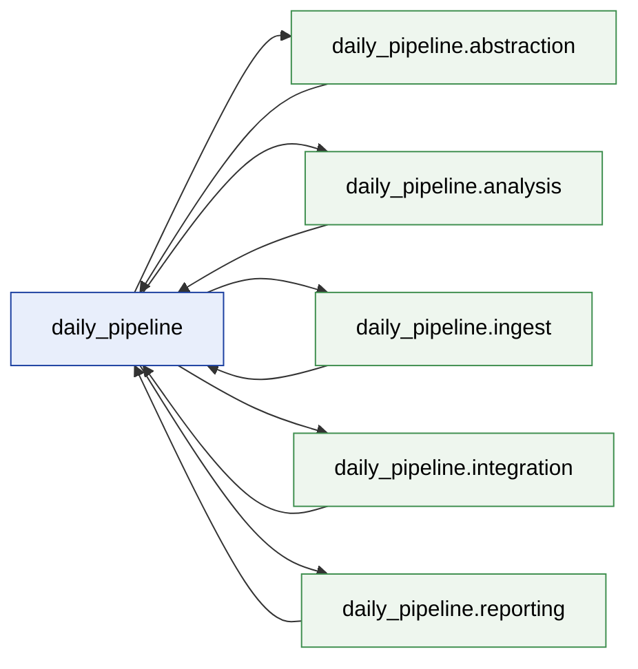
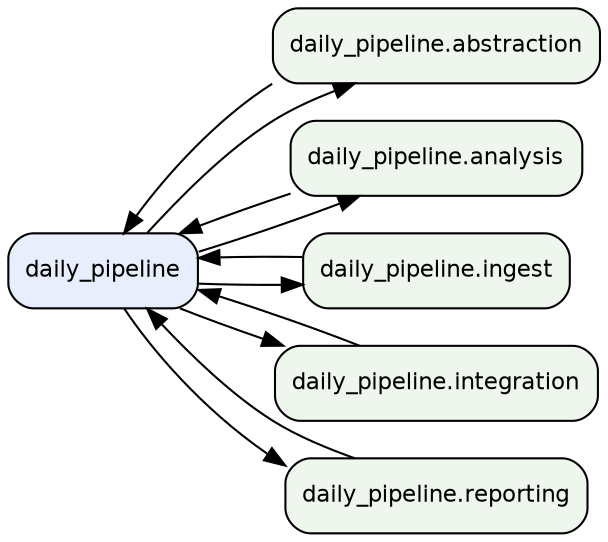

<!-- AGENTTEAMS:BEGIN content v=1 -->
# daily_pipeline — Repository Architecture Map

> **Auto-generated.** Regenerated on every commit that touches the `daily_pipeline` package. Do not edit manually — changes will be overwritten.

- Modules mapped: **17**
- Packages: **6**
- Internal import edges: **18**
- Distinct external dependencies: **0**

---

## Package Dependency Diagram

Inter-package import dependencies (module-level detail in the tables below).



---

## Packages

| Package | Modules | Depends on |
| --- | --- | --- |
| `daily_pipeline` | 10 | `daily_pipeline.abstraction`, `daily_pipeline.analysis`, `daily_pipeline.ingest`, `daily_pipeline.integration`, `daily_pipeline.reporting` |
| `daily_pipeline.abstraction` | 1 | `daily_pipeline` |
| `daily_pipeline.analysis` | 2 | `daily_pipeline` |
| `daily_pipeline.ingest` | 1 | `daily_pipeline` |
| `daily_pipeline.integration` | 2 | `daily_pipeline` |
| `daily_pipeline.reporting` | 1 | `daily_pipeline` |

---

## Module Dependency Table

| Module | Imports (internal) | Imported by |
| --- | --- | --- |
| `daily_pipeline` | — | — |
| `daily_pipeline.abstraction` | — | — |
| `daily_pipeline.abstraction.synthesizer` | `daily_pipeline.models` | `daily_pipeline.protocol` |
| `daily_pipeline.analysis` | — | — |
| `daily_pipeline.analysis.capabilities` | `daily_pipeline.models` | `daily_pipeline.protocol` |
| `daily_pipeline.analysis.references` | `daily_pipeline.models` | `daily_pipeline.protocol` |
| `daily_pipeline.cli` | `daily_pipeline.config`, `daily_pipeline.integration.sync`, `daily_pipeline.protocol` | — |
| `daily_pipeline.config` | — | `daily_pipeline.cli`, `daily_pipeline.protocol` |
| `daily_pipeline.ingest` | — | — |
| `daily_pipeline.ingest.loader` | `daily_pipeline.models` | `daily_pipeline.protocol` |
| `daily_pipeline.integration` | — | — |
| `daily_pipeline.integration.agentteams` | `daily_pipeline.models` | `daily_pipeline.protocol` |
| `daily_pipeline.integration.sync` | `daily_pipeline.models` | `daily_pipeline.cli` |
| `daily_pipeline.models` | — | `daily_pipeline.abstraction.synthesizer`, `daily_pipeline.analysis.capabilities`, `daily_pipeline.analysis.references`, `daily_pipeline.ingest.loader`, `daily_pipeline.integration.agentteams`, `daily_pipeline.integration.sync`, `daily_pipeline.protocol`, `daily_pipeline.reporting.writer` |
| `daily_pipeline.protocol` | `daily_pipeline.abstraction.synthesizer`, `daily_pipeline.analysis.capabilities`, `daily_pipeline.analysis.references`, `daily_pipeline.config`, `daily_pipeline.ingest.loader`, `daily_pipeline.integration.agentteams`, `daily_pipeline.models`, `daily_pipeline.reporting.writer` | `daily_pipeline.cli` |
| `daily_pipeline.reporting` | — | — |
| `daily_pipeline.reporting.writer` | `daily_pipeline.models` | `daily_pipeline.protocol` |

---

## External Dependencies

Third-party (non-stdlib) top-level packages imported by the mapped package:

_None detected (standard library only)._

---

## DOT Source



---

## JSON (module-level)

```json
{
  "root_package": "daily_pipeline",
  "modules": {
    "daily_pipeline": {
      "package": "daily_pipeline",
      "path": "daily_pipeline/__init__.py",
      "is_package": true,
      "imports_internal": [],
      "external": [],
      "repo_local": []
    },
    "daily_pipeline.abstraction": {
      "package": "daily_pipeline",
      "path": "daily_pipeline/abstraction/__init__.py",
      "is_package": true,
      "imports_internal": [],
      "external": [],
      "repo_local": []
    },
    "daily_pipeline.abstraction.synthesizer": {
      "package": "daily_pipeline.abstraction",
      "path": "daily_pipeline/abstraction/synthesizer.py",
      "is_package": false,
      "imports_internal": [
        "daily_pipeline.models"
      ],
      "external": [],
      "repo_local": []
    },
    "daily_pipeline.analysis": {
      "package": "daily_pipeline",
      "path": "daily_pipeline/analysis/__init__.py",
      "is_package": true,
      "imports_internal": [],
      "external": [],
      "repo_local": []
    },
    "daily_pipeline.analysis.capabilities": {
      "package": "daily_pipeline.analysis",
      "path": "daily_pipeline/analysis/capabilities.py",
      "is_package": false,
      "imports_internal": [
        "daily_pipeline.models"
      ],
      "external": [],
      "repo_local": []
    },
    "daily_pipeline.analysis.references": {
      "package": "daily_pipeline.analysis",
      "path": "daily_pipeline/analysis/references.py",
      "is_package": false,
      "imports_internal": [
        "daily_pipeline.models"
      ],
      "external": [],
      "repo_local": []
    },
    "daily_pipeline.cli": {
      "package": "daily_pipeline",
      "path": "daily_pipeline/cli.py",
      "is_package": false,
      "imports_internal": [
        "daily_pipeline.config",
        "daily_pipeline.integration.sync",
        "daily_pipeline.protocol"
      ],
      "external": [],
      "repo_local": []
    },
    "daily_pipeline.config": {
      "package": "daily_pipeline",
      "path": "daily_pipeline/config.py",
      "is_package": false,
      "imports_internal": [],
      "external": [],
      "repo_local": []
    },
    "daily_pipeline.ingest": {
      "package": "daily_pipeline",
      "path": "daily_pipeline/ingest/__init__.py",
      "is_package": true,
      "imports_internal": [],
      "external": [],
      "repo_local": []
    },
    "daily_pipeline.ingest.loader": {
      "package": "daily_pipeline.ingest",
      "path": "daily_pipeline/ingest/loader.py",
      "is_package": false,
      "imports_internal": [
        "daily_pipeline.models"
      ],
      "external": [],
      "repo_local": []
    },
    "daily_pipeline.integration": {
      "package": "daily_pipeline",
      "path": "daily_pipeline/integration/__init__.py",
      "is_package": true,
      "imports_internal": [],
      "external": [],
      "repo_local": []
    },
    "daily_pipeline.integration.agentteams": {
      "package": "daily_pipeline.integration",
      "path": "daily_pipeline/integration/agentteams.py",
      "is_package": false,
      "imports_internal": [
        "daily_pipeline.models"
      ],
      "external": [],
      "repo_local": []
    },
    "daily_pipeline.integration.sync": {
      "package": "daily_pipeline.integration",
      "path": "daily_pipeline/integration/sync.py",
      "is_package": false,
      "imports_internal": [
        "daily_pipeline.models"
      ],
      "external": [],
      "repo_local": []
    },
    "daily_pipeline.models": {
      "package": "daily_pipeline",
      "path": "daily_pipeline/models.py",
      "is_package": false,
      "imports_internal": [],
      "external": [],
      "repo_local": []
    },
    "daily_pipeline.protocol": {
      "package": "daily_pipeline",
      "path": "daily_pipeline/protocol.py",
      "is_package": false,
      "imports_internal": [
        "daily_pipeline.abstraction.synthesizer",
        "daily_pipeline.analysis.capabilities",
        "daily_pipeline.analysis.references",
        "daily_pipeline.config",
        "daily_pipeline.ingest.loader",
        "daily_pipeline.integration.agentteams",
        "daily_pipeline.models",
        "daily_pipeline.reporting.writer"
      ],
      "external": [],
      "repo_local": []
    },
    "daily_pipeline.reporting": {
      "package": "daily_pipeline",
      "path": "daily_pipeline/reporting/__init__.py",
      "is_package": true,
      "imports_internal": [],
      "external": [],
      "repo_local": []
    },
    "daily_pipeline.reporting.writer": {
      "package": "daily_pipeline.reporting",
      "path": "daily_pipeline/reporting/writer.py",
      "is_package": false,
      "imports_internal": [
        "daily_pipeline.models"
      ],
      "external": [],
      "repo_local": []
    }
  },
  "package_edges": [
    {
      "source": "daily_pipeline",
      "target": "daily_pipeline.abstraction"
    },
    {
      "source": "daily_pipeline",
      "target": "daily_pipeline.analysis"
    },
    {
      "source": "daily_pipeline",
      "target": "daily_pipeline.ingest"
    },
    {
      "source": "daily_pipeline",
      "target": "daily_pipeline.integration"
    },
    {
      "source": "daily_pipeline",
      "target": "daily_pipeline.reporting"
    },
    {
      "source": "daily_pipeline.abstraction",
      "target": "daily_pipeline"
    },
    {
      "source": "daily_pipeline.analysis",
      "target": "daily_pipeline"
    },
    {
      "source": "daily_pipeline.ingest",
      "target": "daily_pipeline"
    },
    {
      "source": "daily_pipeline.integration",
      "target": "daily_pipeline"
    },
    {
      "source": "daily_pipeline.reporting",
      "target": "daily_pipeline"
    }
  ],
  "module_edges": [
    {
      "source": "daily_pipeline.abstraction.synthesizer",
      "target": "daily_pipeline.models"
    },
    {
      "source": "daily_pipeline.analysis.capabilities",
      "target": "daily_pipeline.models"
    },
    {
      "source": "daily_pipeline.analysis.references",
      "target": "daily_pipeline.models"
    },
    {
      "source": "daily_pipeline.cli",
      "target": "daily_pipeline.config"
    },
    {
      "source": "daily_pipeline.cli",
      "target": "daily_pipeline.integration.sync"
    },
    {
      "source": "daily_pipeline.cli",
      "target": "daily_pipeline.protocol"
    },
    {
      "source": "daily_pipeline.ingest.loader",
      "target": "daily_pipeline.models"
    },
    {
      "source": "daily_pipeline.integration.agentteams",
      "target": "daily_pipeline.models"
    },
    {
      "source": "daily_pipeline.integration.sync",
      "target": "daily_pipeline.models"
    },
    {
      "source": "daily_pipeline.protocol",
      "target": "daily_pipeline.abstraction.synthesizer"
    },
    {
      "source": "daily_pipeline.protocol",
      "target": "daily_pipeline.analysis.capabilities"
    },
    {
      "source": "daily_pipeline.protocol",
      "target": "daily_pipeline.analysis.references"
    },
    {
      "source": "daily_pipeline.protocol",
      "target": "daily_pipeline.config"
    },
    {
      "source": "daily_pipeline.protocol",
      "target": "daily_pipeline.ingest.loader"
    },
    {
      "source": "daily_pipeline.protocol",
      "target": "daily_pipeline.integration.agentteams"
    },
    {
      "source": "daily_pipeline.protocol",
      "target": "daily_pipeline.models"
    },
    {
      "source": "daily_pipeline.protocol",
      "target": "daily_pipeline.reporting.writer"
    },
    {
      "source": "daily_pipeline.reporting.writer",
      "target": "daily_pipeline.models"
    }
  ],
  "external_dependencies": [],
  "repo_local_dependencies": []
}
```
<!-- AGENTTEAMS:END content -->
